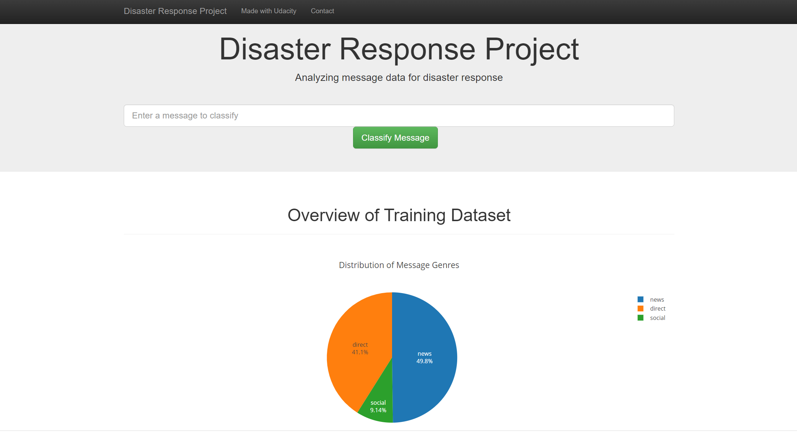
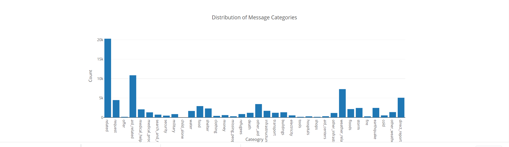

# Disaster_Response_Pipeline
## Motivation
This project analyzes real disaster data messages from [Figure Eight](https://appen.com/) and builds an API model that classifies disaster messages by creating a machine learning pipeline to categorize these disaster events so that you can send the messages to an appropriate disaster relief agency.
The project includes a web app where an emergency worker can input a new message and get classification results in several categories. The web app also displays visualizations of the data.

Below are a few screenshots of the web app.

## Libraries
- pandas
- scikit-learn
- nltk
- sqlalchemy
- plotly
- flask

## Project Files
#### 1. [process_data.py](https://github.com/Sumaya52/Disaster_Response_Pipeline/blob/main/data/process_data.py)
This file contains a data cleaning pipeline that:
- Loads the messages and categories datasets
- Merges the two datasets
- Cleans the data
- Stores it in a SQLite database

#### 2. [train_classifer.py](https://github.com/Sumaya52/Disaster_Response_Pipeline/blob/main/models/train_classifier.py)
This file contains a machine learning pipeline that:
- Loads data from the SQLite database
- Splits the dataset into training and test sets
- Builds a text processing and machine learning pipeline
- Trains and tunes a model using GridSearchCV
- Outputs results on the test set
- Exports the final model as a pickle file

#### 3. [run.py](https://github.com/Sumaya52/Disaster_Response_Pipeline/blob/main/app/run.py)
This file creates the web app using flask, html, css and javascript. It also provides data visualizations using Plotly.

## Instructions
1. Run the following commands in the project's root directory to set up the database and model.

    - To run ETL pipeline that cleans data and stores in database
        `python data/process_data.py data/disaster_messages.csv data/disaster_categories.csv data/DisasterResponse.db`
    - To run ML pipeline that trains classifier and saves
        `python models/train_classifier.py data/DisasterResponse.db models/classifier.pkl`

2. Run the following command in the app's directory to run your web app.
    `python run.py`

3. Go to http://0.0.0.0:3001/

